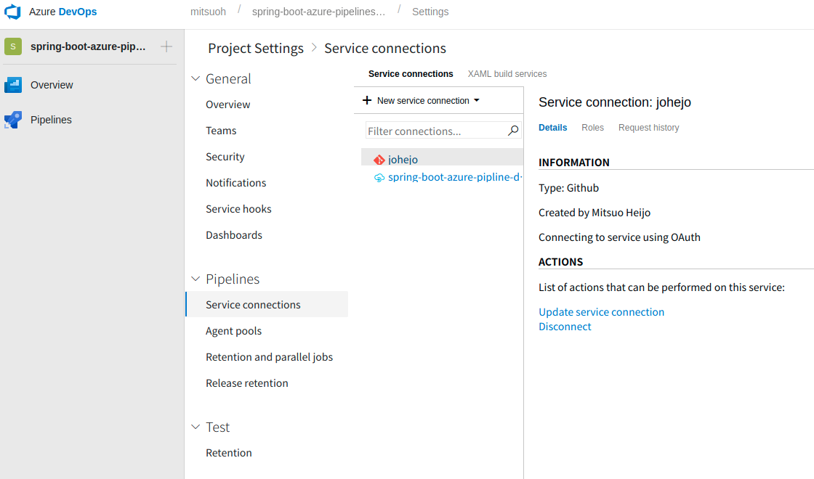
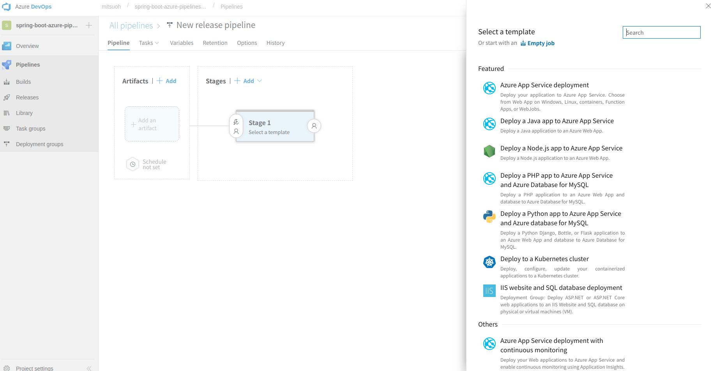

Azure PipelinesとはAzure DevOpsの機能（コンポーネント？）の1つでいわゆるCI/CDツールです。  
https://azure.microsoft.com/ja-jp/services/devops/pipelines/

とにかくAzureとの連携が簡単でした。

軽く試してみたのでその記録を残しておきたいと思います。
<!--more-->

#### はじめに

Azure Pipelinesはオープンソースのプロジェクトなら無料で時間無制限で10個の並列ジョブが使えます。  
https://azure.microsoft.com/en-us/blog/announcing-azure-pipelines-with-unlimited-ci-cd-minutes-for-open-source/

スクリーンショットの中など、ところどころ`pipeline`と言う文字列がありますが、サービス名は正確には`Azure Pipelines`です。（リソースグループなどを作るときにtypoしました。。。)

#### Spring Bootのプロジェクトの用意

Spring Initializrを使います。  
https://start.spring.io/

今回はGradle Projectを選択し、DependenciesにはWebを指定しました。

Generate Projectをクリックして、ダウンロードしたzipファイルを適当なところに展開してさくっとControllerを書きます。

```java
package com.example.demo;

import org.springframework.web.bind.annotation.RequestMapping;
import org.springframework.web.bind.annotation.RestController;

@RestController
public class HelloController {
    @RequestMapping("/hello")
    public String hello() {
        return "Hello World!";
    }
}
```

適当にローカルでデバッグしてInitial Commitを行ったら、一旦そのままリモートリポジトリにpushします。

今回はリモートリポジトリのホスティング先にはGitHubを使いました。

#### Azure Container Registryの準備

Azureのドキュメントがとてもわかりやすいのでここでは割愛します。  
https://docs.microsoft.com/ja-jp/azure/container-registry/container-registry-get-started-azure-cli

#### Azure DevOpsの準備

GitHubのMarketplaceでGitHubアカウントと連携させます。なお連携にはMicrosoftアカウントが必要になります。  
https://github.com/marketplace/azure-pipelines

途中でリポジトリのアクセス権限を聞かれたら先ほどのdemoアプリのリポジトリを選択します。

Azure DevOpsのトップページでCreate projectをクリックしてプロジェクトを作ります。

#### Service connectionの設定

Azure DevOpsのプロジェクトをAzure上のリソースと連携させるためにService connectionを作成します。



今回はAzure Resource Managerを選択して先ほどの作成したAzure Container Registryが入っているリソースグループを指定します。

#### Azure Pipelinesの準備

プロジェクトができたらPipelinesのところでNewをクリックしてパイプラインを作ります。ここでは既存のパイプラインのインポートもできるみたいです。

New Pipelinesではソースリポジトリを選んで進んでいくとChoose a templeteでGradleが出てくるので選びます。

他の言語でもおそらく各言語のメジャーなビルドツールのtemplateは大体あると思います。

templateを選ぶとエディターが開くのでazure-pipelines.ymlをここで編集できます。

```
trigger:
  - master

variables:
  Azure.ServiceConnectionId: 'YOUR_CONNECTION_NAME' # ここで作成したService ConnectionのConnection nameを指定
  ACR.Name: 'BAR' # ACRの名前

  ACR.RepositoryName: '$(ACR.Name)'
  ACR.ImageName: '$(ACR.Name):master'
  ACR.FullName: '$(ACR.Name).azurecr.io'

jobs:

  - job: BuildImage
    displayName: Build

    pool:
      vmImage: 'Ubuntu-16.04'

    steps:
      - task: Gradle@2
        displayName: 'Build module'
        inputs:
          workingDirectory: ''
          gradleWrapperFile: 'gradlew'
          gradleOptions: '-Xmx3072m'
          javaHomeOption: 'JDKVersion'
          jdkVersionOption: '1.11'
          jdkArchitectureOption: 'x64'
          publishJUnitResults: false
          testResultsFiles: '**/TEST-*.xml'
          tasks: 'build'

      - task: Docker@1
        displayName: 'Build an image'
        inputs:
          azureSubscriptionEndpoint: '$(Azure.ServiceConnectionId)'
          azureContainerRegistry: '$(ACR.FullName)'
          imageName: '$(ACR.ImageName)'
          command: build

      - task: Docker@1
        displayName: 'Push an image'
        inputs:
          azureSubscriptionEndpoint: '$(Azure.ServiceConnectionId)'
          azureContainerRegistry: '$(ACR.FullName)'
          imageName: '$(ACR.ImageName)'
          command: push
```

これはあくまで一例です。

こんな感じで最後にRUNをクリックして完了です。

#### リポジトリ・参考にしたもの

- この記事で使ったリポジトリ https://github.com/johejo/spring-boot-azure-pipelines-demo
- Azureのドキュメント https://docs.microsoft.com/en-us/azure/devops/pipelines/?view=vsts
- azure-pipelines.ymlのサンプル https://github.com/Microsoft/azure-pipelines-yaml

#### 最後に

大体のCI/CDツールではbashスクリプトを書く必要がありますが、今回は一行も書かずに済んだのも印象に残りました。

なお、今回はAzure Container Resistryにdockerイメージをpushするところまででしたが、Kubernetesなどを意識するなら、更にPipelineを追加してデプロイタスクを定義できます。



Azure Kuberneters Serviceにデプロイする部分はまたいつか書きたいと思います。
